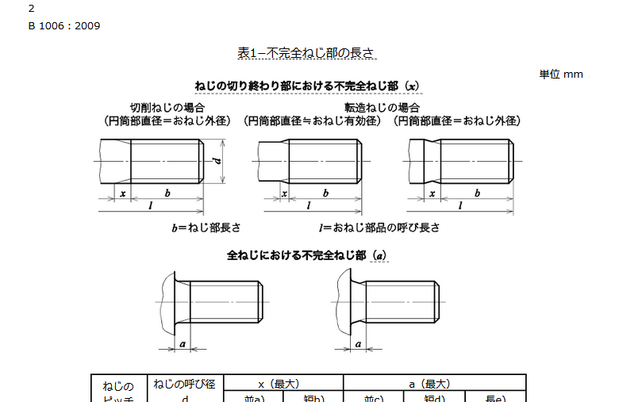
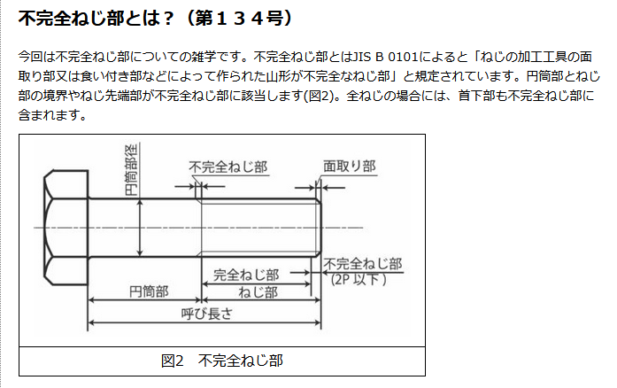

締結用部品−一般用メートルねじをもつ 
https://kikakurui.com/b1/B1006-2009-01.html

## 不完全ネジ部

用語： 不完全ねじ部

定義：
ネジの加工工具の面取り部又は食い付き部などによって作られた山形が不完全なネジ部（付図2102）。
円筒部をもつおねじ部品では、円筒部と完全ねじ部（※1）との境界部及びネジ先端部に、不完全ねじ部が生じる。
全ネジのおねじ部品では、首下部及びねじ先端部に生じる。

https://kikakurui.com/b0/B0101-2013-01.html

ねじの加工工具の面取り部又は食い付き部などによって作られ
た山形が不完全なねじ部（図2103）。円筒部をもつおねじ部品で
は，円筒部と完全ねじ部との境界部及びねじ先端部に，不完全
ねじ部が生じる。全ねじのおねじ部品では，首下部及びねじ先
端部に生じる。
